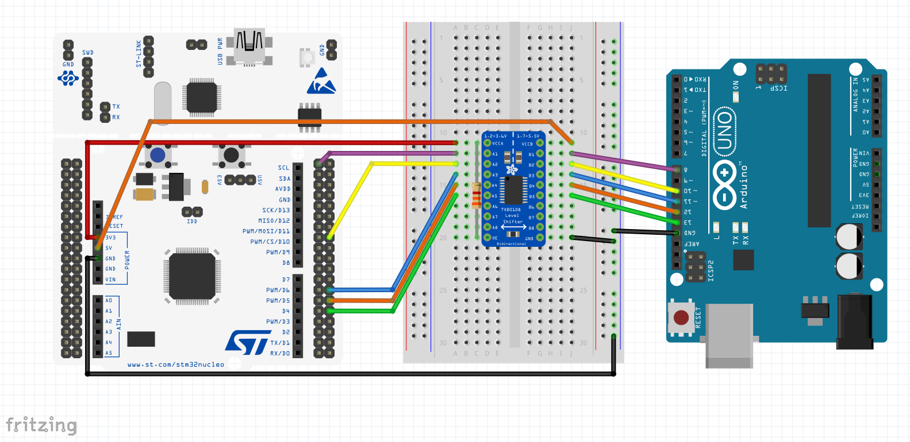
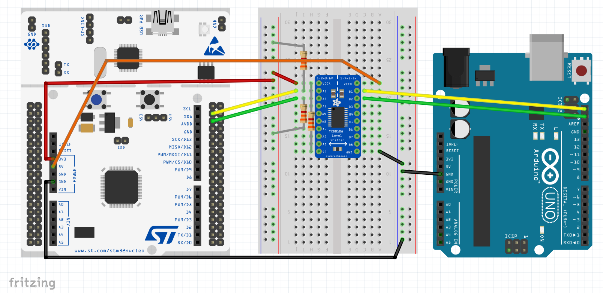
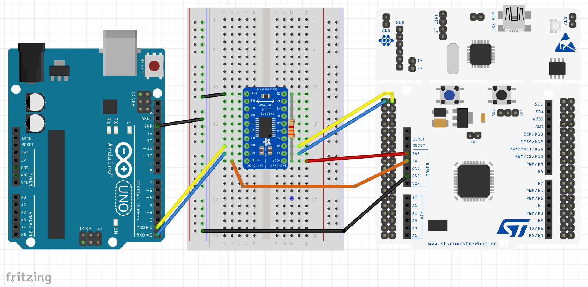
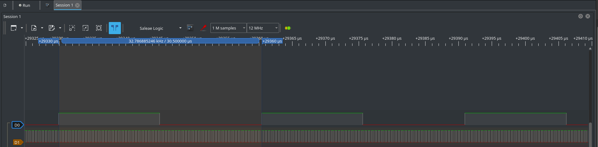

# NUCLEO-F446RE from Scratch
This is an embedded project for [NUCLEO-F446RE](https://www.st.com/en/evaluation-tools/nucleo-f446re.html) board, based on [STM32F446RE](https://www.st.com/en/microcontrollers-microprocessors/stm32f446re.html) microcontroller.

It contains drivers for GPIO, SPI, I2C, USART, RCC and TIMER peripherals.

## OpenOCD
You can use OpenOCD (Open On-Chip Debugger) for programming or debugging this project. You can starting OpenOCD typing:
```console
openocd -f board/st_nucleo_f4.cfg
```
Or using the Makefile:
```console
make load
```
You can use a telnet connection for connecting to the OpenOCD server:
```console
telnet 127.0.0.1 4444
```
You can program the microcontroller using:
```console
reset init
flash write_image erase your_app.elf
reset
```
Remember you must enable semihosting in the telnet session if you compile the project for using this feature (you can see printf outputs):
```console
arm semihosting enable
```
## Test
### Test SPI Driver
For testing the SPI driver you need to use the Nucleo board, an Arduino UNO board and also a logic level converter; due to the Nucleo board works with 3.3V PIN level and Arduino UNO board works with 5V PIN level.

You need to set TEST_SPI to 1 in the [test.c](src/tst/test.c) file for enabling the code to test the SPI peripheral driver.

You can use the SPI2_SendHello API placed in [test_spi.c](src/tst/test_spi.c) file which sends the "Hello World" string to the Arduino board, for testing with this API you need to use the [SPISlvRx.ino](ard/SPI/SPISlvRx/SPISlvRx.ino) sketch. You need to open a Serial Monitor using the Arduino IDE configuring a speed of 9600 baud for receiving this string.

You can test the SPI driver in a bidirectional way using the SPI_SendCmds API placed in [test_spi.c](src/tst/test_spi.c) file or using the different APIs for commands in that file. For testing the command APIs you need to use the [SPISlvCmd.ino](ard/SPI/SPISlvCmd/SPISlvCmd.ino) sketch. You need to open a Serial Monitor using the Arduino IDE configuring a speed of 9600 baud and you should use also the semi hosting binary for the STM32 microcontroller for watching further information.

Finally, if you want to test the interrupt mode in the SPI driver you need to use the [SPISlvTxIrq.ino](ard/SPI/SPISlvTxIrq/SPISlvTxIrq.ino) sketch. In this test you will send a string typed in the Serial Monitor of the Arduino IDE to the Nucleo board, and it will be printed in a terminal using semi hosting. You need to open a Serial Monitor using the Arduino IDE configuring a speed of 9600 baud for typing the string, and you need to use the semi hosting binary for the STM32 microcontroller in order to watch the received string.

For performing all these tests you need to follow the connection diagram below:

In this diagram:
| PIN Functionality      | Nucleo PIN | Arduino PIN |
|:----------------------:|:----------:|:-----------:|
| SPI MISO               | PB14       | Digital 12  |
| SPI MOSI               | PB15       | Digital 11  |
| SPI SCLK               | PB13       | Digital 13  |
| SPI NSS                | PB12       | Digital 10  |
| Interrupt notification | PC9        | Digital 8   |

### Test I2C Driver
For testing the I2C driver you need to use the Nucleo board, an Arduino UNO board and also a logic level converter; due to the Nucleo board works with 3.3V PIN level and Arduino UNO board works with 5V PIN level.

You need to set TEST_I2C to 1 in the [test.c](src/tst/test.c) file for enabling the code to test the I2C peripheral driver.

You can use the I2C1_SendHello API placed in the [test_i2c.c](src/tst/test_i2c.c) file which sends the "Hello World" string to the Arduino board, for testing with this API you need to use the [I2CSlvRx.ino](ard/I2C/I2CSlvRx/I2CSlvRx.ino) sketch. You need to open a Serial Monitor using the Arduino IDE configuring a speed of 9600 baud for receiving this string. In this test the Nucleo board is the master so you need to set the I2C_MASTER define to 1 in the [test_i2c.c](src/tst/test_i2c.c) file.

You can test transmission and reception using the I2C1_SendCmd API placed in the [test_i2c.c](src/tst/test_i2c.c) file which sends two commands to the Arduino board and this will send an answer. These commands are:
| Command ID | Functionality                            |
|:----------:|:----------------------------------------:|
| 0x51       | Request the lenght of a string to send   |
| 0x52       | Request to send the string               |

For testing with this API you need to use the [I2CSlvCmd.ino](ard/I2C/I2CSlvCmd/I2CSlvCmd.ino) sketch.You need to open a Serial Monitor using the Arduino IDE configuring a speed of 9600 baud and you should use also the semi hosting binary for the STM32 microcontroller for watching further information. In this test the Nucleo board is the master so you need to set the I2C_MASTER define to 1 in the [test_i2c.c](src/tst/test_i2c.c) file.

If you use the I2C1_SendCmdIT API you will test the transmission and reception using interrupt mode.

You can also test the I2C driver in slave mode, you need to set the I2C_MASTER define to 0 in the [test_i2c.c](src/tst/test_i2c.c) file. For this test you need to use the [I2CMstRx.ino](ard/I2C/I2CMstRx/I2CMstRx.ino) sketch. You need to open a Serial Monitor using the Arduino IDE configuring a speed of 9600 baud for sending the commands from Arduino as master.

For performing all these tests you need to follow the connection diagram below:

In this diagram:
| PIN Functionality      | Nucleo PIN | Arduino PIN |
|:----------------------:|:----------:|:-----------:|
| I2C SDA                | PB9        | GPIO 19     |
| I2C SLC                | PB8        | GPIO 18     |

### Test USART Driver

For testing the USART driver you need to use the Nucleo board, an Arduino UNO board and also a logic level converter; due to the Nucleo board works with 3.3V PIN level and Arduino UNO board works with 5V PIN level.

You need to set TEST_USART to 1 in the [test.c](src/tst/test.c) file for enabling the code to test the USART peripheral driver.

You can use the USART3_SendHello API placed in the [test_usart.c](src/tst/test_usart.c) file which sends the "Hello World" string to the Arduino board, for testing with this API you need to use the [USARTRx.ino](ard/USART/USARTRx/USARTRx.ino) sketch. You need to open a Serial Monitor using the Arduino IDE configuring a speed of 115200 baud for receiving this string.

You can use the USART3_TxRx API for testing the transmission and reception APIs of the USART driver. This function is placed in the [test_usart.c](src/tst/test_usart.c) file. You will need to use the [USARTRxTx.ino](ard/USART/USARTRxTx/USARTRxTx.ino) sketch for the Arduino board. You need to open a Serial Monitor using the Arduino IDE configuring a speed of 115200 baud for receiving this string.

For performing all these tests you need to follow the connection diagram below:

In this diagram:
| PIN Functionality      | Nucleo PIN | Arduino PIN |
|:----------------------:|:----------:|:-----------:|
| UART TX                | PC10       | GPIO 1      |
| UART RX                | PC11       | GPIO 0      |

Warning!!! You need to disconnect the cable from GPIO0 (RX PIN) of Arduino board before programming the sketch; in other way the programming process will fail.

### Test Reset and Clock Control (RCC) Driver
You need to set TEST_RCC to 1 in the [test.c](src/tst/test.c) file for enabling the code to test the RCC peripheral driver.
Each API of the test enable and cofigure a different clock configuration, SetHSEBypass() and SetPLLMax() APIs will show you the configuration set using the semihosting console, while SetMCO_LSE_HSE() and SetMCO_PLL() will send two clock signals through the GPIO PA8 and PA9.

Console output when SetHSEBypass() API is executed:
```console
Starting program!!!
PCLK1 Value: 8000000
PCLK2 Value: 8000000
PLL Output Clock: 96000000
```
Console output when SetPLLBypass() API is executed:
```console
Starting program!!!
PCLK1 Value: 45000000
PCLK2 Value: 90000000
PLL Output Clock: 180000000
```
Snapshot of GPIO PA8 (using MCO1 with LSE crystal) (D0 channel) and PC9 (using MCO2 with HSE clock and prescaler set to 4) (D1 channel) using a logic analyzer when SetMCO_LSE_HSE() API is executed:

